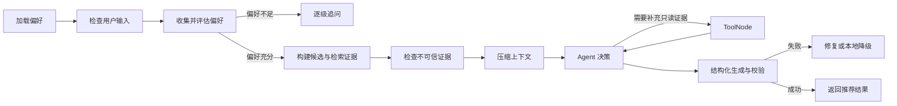

# 面向动漫评论的情感分析与舆情监控系统

> 基于 TextCNN / BERT 的三分类情感分析 + LDA 主题建模 + LangGraph Agent + 混合 RAG + Vue 3 可视化看板
>
> 毕业设计项目（2026届）· Python 3.12 + FastAPI 0.139 + Vue 3 + MySQL 8 / SQLite 兼容

> [!IMPORTANT]
> 当前推荐 Agent 2.0 已迁移为 LangGraph `StateGraph`。运行时 Prompt 由
> `backend/prompts/registry.py` 加载不可变版本，不再读取
> `backend/prompts/templates/*.yaml` 形式的旧平铺模板。Prompt 的版本、模板哈希和
> 安全诊断会随 Agent 任务写入 `prompt_trace`。
>
> 当前业务持久化已统一到 SQLAlchemy 2.0 的 16 张 ORM 表。生产/本机运行优先
> 使用 MySQL；SQLite 保留为迁移源、测试隔离数据库和未配置 MySQL 时的兼容后端。

---

## 目录

1. [项目背景与研究意义](#1-项目背景与研究意义)
2. [系统整体架构](#2-系统整体架构)
3. [实现目标与核心功能](#3-实现目标与核心功能)
4. [技术选型](#4-技术选型)
5. [数据采集模块](#5-数据采集模块)
6. [数据清洗与预处理](#6-数据清洗与预处理)
7. [训练数据构建与自动标注](#7-训练数据构建与自动标注)
8. [情感分析模型](#8-情感分析模型)
9. [主题挖掘模块](#9-主题挖掘模块)
10. [后端 API 服务](#10-后端-api-服务)
11. [前端可视化看板](#11-前端可视化看板)
12. [用户认证系统](#12-用户认证系统)
13. [AI 智能推荐模块](#13-ai-智能推荐模块)
14. [数据库设计](#14-数据库设计)
15. [完整数据流水线](#15-完整数据流水线)
16. [项目结构](#16-项目结构)
17. [快速开始](#17-快速开始)
18. [模型训练](#18-模型训练)

---

## 1. 项目背景与研究意义

随着二次元文化的蓬勃发展，B 站（哔哩哔哩）、Bangumi（班固米）等平台积累了海量动漫评论与弹幕数据。这些用户生成内容（UGC）蕴含着丰富的舆情信息——观众对剧情、作画、声优、音乐等各维度的真实评价——但受制于数据量大、中文口语化等特点，传统方法难以高效挖掘其中的价值。

本项目以"面向动漫评论的情感分析与舆情监控"为核心命题，研究并实践以下关键技术问题：

- **中文短文本情感分析**：动漫评论存在大量表情符号、网络用语、中英混杂等噪声，如何有效建模情感极性（正面 / 中性 / 负面）？
- **主题发现**：如何从非结构化评论中自动挖掘用户关注的话题焦点（剧情、作画、配乐、角色等）？
- **多平台数据融合**：B 站（弹幕+评论）与 Bangumi（评分+吐槽）数据格式差异较大，如何统一清洗入库？
- **大模型与传统分析结合**：如何将 LLM 的语义理解能力与数据库中的情感统计结果结合，提供有依据的动漫推荐？

---

## 2. 系统整体架构

系统采用**前后端分离**架构，主要层次如下：

```
┌─────────────────────────────────────────────────────────────┐
│                    前端层（Vue 3 + ECharts）                  │
│ 登录/注册 → 动漫列表/看板 → Agent 中心 → RAG 评测              │
└─────────────────────────┬───────────────────────────────────┘
                          │ HTTP REST API (JSON)
┌─────────────────────────▼───────────────────────────────────┐
│               后端层（FastAPI + Uvicorn ASGI）                │
│ auth / data / sentiment / topic / recommend / history / agent / rag │
└──────┬──────────────┬──────────────┬──────────────┬─────────┘
       │              │              │              │
┌──────▼──────┐ ┌─────▼──────┐ ┌────▼────┐ ┌──────▼──────────┐
│  情感分析   │ │  主题挖掘  │ │ Agent  │ │   Bangumi API   │
│ TextCNN/BERT│ │  gensim LDA│ │LangGraph│ │  bgm.tv 评分    │
└─────────────┘ └────────────┘ └─────────┘ └─────────────────┘
                          │
┌─────────────────────────▼───────────────────────────────────┐
│       数据层（SQLAlchemy；MySQL 优先 / SQLite 兼容）           │
│ 核心业务 5 表 + Agent 4 表 + RAG/评估 7 表                    │
└─────────────────────────┬───────────────────────────────────┘
                          │ 离线流水线
┌─────────────────────────▼───────────────────────────────────┐
│               数据采集与处理层（离线）                          │
│ 爬虫 → 清洗 → 自动标注 → 模型训练/预测 → LDA → RAG 索引       │
└─────────────────────────────────────────────────────────────┘
```

---

## 3. 实现目标与核心功能

### 3.1 总体目标

构建一套面向动漫领域的**全链路舆情分析系统**，覆盖数据获取、情感建模、主题发现、可视化展示与智能推荐五大环节，并提供完整的用户交互界面。

### 3.2 功能清单

| 模块 | 具体功能 | 技术实现 |
|------|----------|----------|
| **数据采集** | B 站评论/弹幕爬取，支持搜索+按季索引；Bangumi 吐槽箱批量采集（Top100）；豆瓣短评采集 | requests + BeautifulSoup + B站公开 API |
| **数据清洗** | HTML 标签净化、表情符号过滤、URL 去除、纯数字/纯符号过滤、短评过滤（<5字）、去重、jieba 分词、停用词去除 | jieba + pandas + re |
| **自动标注** | Bangumi 按星级标注（7-10分→正面，5-6分→中性，1-4分→负面）；B 站按 SnowNLP 情感打分阈值标注 | snownlp |
| **情感分析** | TextCNN 三分类（准确率 59.63%）；BERT 微调三分类（准确率 67.40%）；支持实时单条预测 | PyTorch + HuggingFace Transformers |
| **主题挖掘** | LDA 主题建模（默认 8 个主题），支持困惑度/一致性自动调参；TF-IDF / TextRank 关键词提取 | gensim |
| **可视化看板** | 情感分布饼图、逐条情感趋势折线图、评论词云、LDA 主题卡片、评论列表（分页+情感过滤） | Vue 3 + ECharts 5 + echarts-wordcloud |
| **用户系统** | 注册/登录、JWT Token 认证、bcrypt 密码哈希、聊天历史持久化 | PyJWT + bcrypt |
| **Agent 中心** | 舆情诊断、多轮偏好推荐、会话/任务持久化、执行步骤和证据追踪 | LangGraph + LangChain + Pydantic |
| **混合 RAG** | Chroma 向量召回与数据库关键词召回并行执行，RRF 融合后可选百炼 Rerank；索引不可用时降级到实时业务表 | Chroma + SQLAlchemy + qwen3-rerank |
| **AI 推荐** | 保留传统单轮推荐；Agent 2.0 通过偏好问卷、候选池、受限只读工具和结构化校验生成可追溯推荐 | OpenAI 兼容接口（Qwen / OpenAI / 智谱） |
| **REST API** | 统一 JSON 格式 `{"code":200,"msg":"...","data":{...}}`，完整的错误码体系 | FastAPI APIRouter |

---

## 4. 技术选型

### 4.1 后端

| 依赖 | 版本 | 用途 |
|------|------|------|
| Python | 3.12 | 后端运行时与依赖基线 |
| FastAPI | 0.139.0 | Web 框架，应用工厂与 APIRouter |
| Uvicorn | 0.51.0 | ASGI 服务（首轮固定单 worker） |
| PyJWT | 2.12.1 | HS256 JWT Token 认证 |
| bcrypt | 5.0.0 | 密码哈希存储 |
| requests | 2.32.3 | HTTP 爬虫 / LLM API 调用 |
| BeautifulSoup4 | 4.12.3 | HTML 解析 |
| pandas | 2.2.3 | 数据处理 |
| jieba | 0.42.1 | 中文分词 |
| snownlp | 0.12.3 | 自动情感标注 |
| scikit-learn | 1.5.2 | 数据集划分、评估指标 |
| PyTorch | 2.11.0 | TextCNN / BERT 训练与推理 |
| transformers | 4.46.3 | bert-base-chinese 预训练模型 |
| gensim | 4.4.0 | LDA 主题建模 |
| SQLAlchemy | 2.0.51 | 16 表统一 ORM、同步/异步事务边界 |
| MySQL | 8.0+ | 默认业务数据库（PyMySQL + aiomysql） |
| SQLite | 内置 | 迁移源、测试隔离与兼容回退 |
| Alembic | 1.18.5 | MySQL Schema 迁移 |
| LangGraph | 1.0.10 | 推荐 Agent 状态图与 Checkpoint |
| Chroma | 0.5.23 | 可重建向量索引 |

### 4.2 前端

| 依赖 | 版本 | 用途 |
|------|------|------|
| Vue | 3.4.0 | 响应式 UI 框架 |
| Vue Router | 4.3.0 | 前端路由 |
| Axios | 1.7.0 | HTTP 请求封装 |
| ECharts | 5.5.0 | 数据可视化图表 |
| echarts-wordcloud | 2.1.0 | 词云图表 |
| Vite | 5.4.0 | 构建工具 |

---

## 5. 数据采集模块

### 5.1 B 站爬虫（`crawler/bilibili_crawler.py`）

**采集对象**：B 站番剧评论区评论（二级评论）及弹幕

**核心机制**：
- 封装 `BiliSession` 类，模拟浏览器请求头（随机 User-Agent），自动获取 `buvid3/buvid4` cookie 及 `bili_ticket`，实现反爬绕过
- 通过 `SEARCH_API` 按动漫名搜索番剧的 `season_id`，再通过 `SECTION_API` 获取各话的 `cid`
- 使用 `COMMENT_API`（`/x/v2/reply`）分页拉取评论，`SUB_REPLY_API` 拉取子评论
- 弹幕通过 `DANMAKU_API` 获取 XML 格式后解析
- 支持断点续采（已有数据不重复写入）

**输出字段**：`content`（评论内容）、`time`（发布时间）、`likes`（点赞数）、`platform="bilibili"`

### 5.2 Bangumi 爬虫（`crawler/bangumi_crawler.py`）

**采集对象**：Bangumi 番剧条目的"吐槽箱"（短评）

**核心机制**：
- 使用 `bgm.tv` 公开 API 搜索动漫，获取 `subject_id`
- 通过网页抓取（BeautifulSoup）解析 `bgm.tv/subject/{id}/comments?page=N`
- 每条评论提取：`content`、`rate`（1-10 星级评分）、`time`

**Top100 批量采集**：`crawler/crawl_top100.py` 脚本读取 `anime_id_list.txt`，批量采集 Bangumi 排名前 100 的番剧数据，已处理结果存于 `data/processed/bangumi_top100/`（100+ 个清洗后的 CSV 文件）

### 5.3 豆瓣爬虫（`crawler/douban_crawler.py`）

通过 BeautifulSoup 解析豆瓣动漫短评页面，提取评分和评论内容，主要作为补充数据源。

---

## 6. 数据清洗与预处理

**核心脚本**：`crawler/cleaner.py`

### 清洗流水线

```
原始 CSV (data/raw/)
    ↓ 去除 HTML 标签 (<[^>]+>)
    ↓ 去除 B 站表情标记 ([xxx])
    ↓ 去除 URL
    ↓ 过滤纯数字 / 纯符号行
    ↓ 过滤过短评论（< 5 个字符）
    ↓ 去重（基于评论内容）
    ↓ jieba 中文分词
    ↓ 停用词过滤（data/stopwords.txt，约 1000+ 条）
清洗后 CSV (`data/processed/`) + 通过 SQLAlchemy 写入当前业务数据库
```

### 数据库写入

清洗后同时将数据写入当前配置数据库的 `anime` 表（若动漫不存在则自动创建）和 `comments` 表，形成结构化存储，供后续模型预测和前端查询使用。生产配置使用 MySQL；测试或显式传入 `--db_path` 时可使用 SQLite。

---

## 7. 训练数据构建与自动标注

**核心脚本**：`data/train/auto_label.py`

### 标注策略

由于缺乏人工标注数据，系统采用**弱监督自动标注**方案：

| 数据来源 | 标注方式 | 标注规则 |
|----------|----------|----------|
| Bangumi（有星级评分） | 基于评分硬规则 | 7-10 分 → `positive`；5-6 分 → `neutral`；1-4 分 → `negative` |
| B 站（无显式评分） | SnowNLP 情感打分 | 分数 > 0.6 → `positive`；0.3-0.6 → `neutral`；< 0.3 → `negative` |

### 输出格式

统一输出为 `data/train/sentiment_train.csv`，包含字段：
- `text`：清洗后的评论文本
- `label`：情感标签（`positive` / `neutral` / `negative`）

每类最多保留 5000 条（可通过 `--max_per_class` 调整），确保类别平衡。

---

## 8. 情感分析模型

### 8.1 TextCNN（`models/textcnn_classifier.py`）

**网络结构**：

```
输入文本 → jieba 分词 → 词索引序列（max_len=128）
    → Embedding 层（embed_dim=128，可选预训练词向量）
    → 并行多尺度卷积层（kernel_size = 2, 3, 4，filters=128）
    → MaxPooling（每个卷积核取全局最大值）
    → Concat（拼接三个 128 维特征，共 384 维）
    → Dropout（p=0.5）
    → 全连接层（384 → 3）
    → Softmax → {positive, neutral, negative}
```

**词汇表**：基于训练语料动态构建，最大词汇量 50,000，包含 `<PAD>` 和 `<UNK>` 特殊 token。

**训练配置**：Adam 优化器，早停（patience=3），学习率调度，batch_size=64，epochs=10

**优势**：推理速度快，模型体积小（< 50MB），适合实时预测

**准确率**：约 60%（验证集 Macro-F1）

### 8.2 BERT 微调（`models/bert_classifier.py`）

**预训练基座**：`bert-base-chinese`（Google 发布，12 层 Transformer，768 维隐藏层，1.1 亿参数）

**微调结构**：

```
输入文本 → BertTokenizer（WordPiece 分词，max_len=128）
    → [CLS] + token ids + [SEP]
    → bert-base-chinese（12 层 Transformer Encoder）
    → 取 [CLS] 位置的 768 维输出
    → Dropout（p=0.3）
    → 全连接层（768 → 3）
    → Softmax → {positive, neutral, negative}
```

**训练配置**：AdamW 优化器，学习率 2e-5（Transformer 层）/ 1e-3（分类头），线性 warmup，batch_size=16，epochs=3-5

**优势**：语义理解能力强，对中文口语化评论效果更好

**准确率**：约 67%（验证集 Macro-F1）

### 8.3 模型评估（`models/evaluator.py`）

`ModelEvaluator` 类提供完整评估报告，包括：
- 总体准确率（Accuracy）
- Macro / Weighted Precision、Recall、F1
- 逐类别（positive/neutral/negative）的精确率、召回率、F1
- 混淆矩阵
- 评估报告保存至 `models/saved/reports/`

### 8.4 批量预测（`batch_predict.py`）

对数据库中所有 `sentiment IS NULL` 的评论执行批量预测，支持 `--model textcnn/bert`，`--overwrite` 强制覆盖已有预测结果，结果写回 `comments.sentiment` 字段。

---

## 9. 主题挖掘模块

### 9.1 LDA 主题模型（`topic/lda_model.py`）

**流程**：
```
从数据库读取指定动漫的全部评论
    → jieba 分词 + 停用词过滤
    → 构建 gensim Dictionary 和 BoW 语料库
    → 训练 LDA 模型（默认 num_topics=8）
    → 计算 Perplexity（困惑度）和 Coherence（一致性，c_v 指标）
    → 提取每个主题权重最高的 10 个关键词
    → 写入数据库 topics 表（JSON 格式存储关键词列表）
```

**超参数寻优**：支持 `--find_best` 模式，在 `[min_topics, max_topics]` 范围内遍历，以一致性得分最高的 num_topics 为最优。

### 9.2 关键词提取（`topic/keyword_extractor.py`）

同时支持：
- **TF-IDF**：基于词频-逆文档频率，适合全局词云
- **TextRank**：基于图排序算法（类似 PageRank），适合摘要式关键词

提取结果用于生成词云数据，存储于数据库 `wordcloud_data` 字段（JSON 格式：`[{"word": "...", "weight": ...}, ...]`）。

---

## 10. 后端 API 服务

### 10.1 应用架构（`backend/app.py`）

采用 FastAPI **应用工厂模式**（`create_app()`），通过 8 个 `APIRouter` 注册接口并统一配置 CORS、JWT、生命周期和错误响应。请求侧数据库访问使用异步 `AsyncSession`；Agent、爬虫、训练和 RAG 索引使用同步 Session。业务数据库优先使用 MySQL，LangGraph Checkpointer 单独保存在 SQLite 文件中，首轮部署固定单 Uvicorn worker。

### 10.2 API 端点一览

#### 认证模块（`/api/auth`）

| 方法 | 路径 | 说明 | 认证 |
|------|------|------|------|
| POST | `/api/auth/register` | 注册（用户名 3-20 位，密码 ≥ 6 位） | 无 |
| POST | `/api/auth/login` | 登录，返回 JWT Token（有效期 24h） | 无 |
| GET  | `/api/auth/me` | 获取当前用户信息 | JWT |

#### 数据查询（`/api`）

| 方法 | 路径 | 说明 |
|------|------|------|
| GET | `/api/anime/list` | 获取所有动漫列表及评论数 |
| GET | `/api/comments/<anime_id>` | 分页查询评论，支持 `sentiment/page/size` 过滤 |

#### 情感分析（`/api/sentiment`）

| 方法 | 路径 | 说明 |
|------|------|------|
| GET | `/api/sentiment/stats/<anime_id>` | 情感统计（正/中/负数量及占比，饼图数据源） |
| GET | `/api/sentiment/trend/<anime_id>` | 按时间聚合的情感趋势（折线图数据源） |
| GET | `/api/sentiment/scatter/<anime_id>` | 逐条情感分值（散点折线数据源） |
| POST | `/api/sentiment/predict` | 实时情感预测 `{"text":"...", "model":"textcnn/bert"}` |

#### 主题挖掘（`/api`）

| 方法 | 路径 | 说明 |
|------|------|------|
| GET | `/api/topics/<anime_id>` | LDA 主题列表（主题编号 + 关键词） |
| GET | `/api/wordcloud/<anime_id>` | 词云数据（词语 + 权重列表） |

#### AI 推荐（`/api/recommend`）

| 方法 | 路径 | 说明 |
|------|------|------|
| POST | `/api/recommend` | `{"query":"用户输入"}` → 动漫推荐卡片 + LLM 生成理由 |
| POST | `/api/agent/recommend/start` | 启动推荐 Agent 2.0 异步会话 |
| POST | `/api/agent/recommend/message` | 回答多级偏好问题或继续推荐会话 |
| GET | `/api/agent/tasks/<task_id>` | 查询异步任务状态与结果 |
| POST | `/api/agent/opinion/analyze` | 启动舆情诊断 Agent |

#### RAG 与 PromptOps（`/api/rag`，均需 JWT）

| 方法 | 路径 | 说明 |
|------|------|------|
| POST | `/api/rag/index/rebuild` | 创建全量索引后台任务 |
| POST | `/api/rag/index/anime/<anime_id>` | 为指定动漫更新索引 |
| GET | `/api/rag/index/jobs/<job_id>` | 查询索引任务进度 |
| GET | `/api/rag/index/status` | 查询活动集合、文档、Embedding 与 Rerank 状态 |
| POST | `/api/rag/search` | 调试混合检索和证据链 |
| POST | `/api/rag/eval/run` | 执行内置检索冒烟评估 |
| GET | `/api/rag/eval/runs[/<run_id>]` | 查询评估历史或详情 |

#### 历史记录（`/api/history`，均需 JWT）

| 方法 | 路径 | 说明 |
|------|------|------|
| POST | `/api/history/chat` | 保存一条聊天消息 |
| GET | `/api/history/chat` | 分页获取聊天历史 |
| DELETE | `/api/history/chat/<msg_id>` | 删除当前用户的指定历史消息 |

### 10.3 统一响应格式

所有接口均返回统一格式：

```json
{
  "code": 200,
  "msg": "success",
  "data": { ... }
}
```

错误时返回对应 HTTP 状态码及 `code` 字段（400 客户端错误、401 未认证、404 不存在、500 服务器错误）。

---

## 11. 前端可视化看板

### 11.1 路由结构

```
/login          → 登录页（未登录强制跳转）
/register       → 注册页
/               → 首页（动漫列表 + AI 推荐对话）  [需登录]
/dashboard/:animeId → 数据看板（指定动漫的完整分析） [需登录]
/history        → 聊天历史页                    [需登录]
/agent          → 智能体中心                    [需登录]
/agent/opinion  → 舆情诊断 Agent                [需登录]
/agent/recommendation → 推荐 Agent 2.0           [需登录]
/agent/evaluation → RAG 评测看板                 [需登录]
```

路由守卫：通过 `localStorage` 中的 JWT Token 判断登录状态，未登录自动重定向至 `/login`。

### 11.2 首页（`Home.vue`）

- 动漫搜索框（实时模糊过滤下拉）
- 动漫列表卡片（展示名称、评论数、情感分布色块）
- 右侧 AI 推荐聊天面板（`RecommendChat.vue`）：与伊蕾娜小助手对话，输入想看的动漫类型或名称，AI 返回推荐卡片（含 Bangumi 评分、情感统计、推荐理由）

### 11.3 数据看板（`Dashboard.vue`）

包含以下可视化组件：

| 编号 | 组件 | 图表类型 | 数据来源 |
|------|------|---------|---------|
| 01 | `SentimentPie.vue` | 饼图（正/中/负三色） | `/api/sentiment/stats` |
| 02 | `SentimentTrend.vue` | 折线散点图（情感分值随时间变化） | `/api/sentiment/scatter` |
| 03 | `WordCloud.vue` | 词云（echarts-wordcloud） | `/api/wordcloud` |
| 04 | `TopicCards.vue` | 主题卡片（LDA 关键词标签列表） | `/api/topics` |
| 05 | `CommentList.vue` | 评论列表（情感标签+分页+过滤） | `/api/comments` |

页面背景采用暗色系科技风 UI，带有粒子网格背景、渐变光晕、毛玻璃导航栏，整体风格契合二次元/动漫主题。

### 11.4 推荐对话组件（`RecommendCard.vue` / `RecommendChat.vue`）

AI 推荐响应返回一张结构化"推荐卡片"，展示：
- 动漫名称、所属平台、评论总数
- Bangumi 综合评分（实时调用 bgm.tv API）
- 情感多维度分析（作画/剧情/声优正负面占比）
- LLM 生成的个性化推荐语

### 11.5 Agent 中心与 RAG 看板

- `AgentCenter.vue`：舆情、推荐和 RAG 评测入口。
- `OpinionAgentPage.vue`：轮询后台任务并展示舆情报告、执行步骤、Prompt Trace 和证据链。
- `RecommendationAgentPage.vue`：多轮偏好问卷、偏好记忆、结构化推荐和本地降级状态。
- `RagEvaluationPage.vue`：索引任务、检索调试、证据链和内置评估结果。

---

## 12. 用户认证系统

### 安全设计

- **密码存储**：bcrypt 哈希（加盐），不存储明文密码，防止数据库泄露后密码被逆推
- **Token 认证**：PyJWT 生成 HS256 签名的 JWT，有效期 24 小时，并保留旧 Token 的 claims 兼容性
- **输入验证**：用户名正则校验（3-20 位，字母/数字/下划线/中文），密码长度 6-72 位限制
- **CORS 配置**：限定允许跨域的来源域，防止 CSRF

### 聊天历史持久化

用户每次与 AI 推荐助手的对话（user/assistant 双向消息）均以 `role + content + anime_card(JSON)` 格式持久化至 `chat_history` 表，支持分页查看历史会话记录。

---

## 13. AI 智能推荐模块

### 13.1 推荐 Agent 2.0 流程

推荐 Agent 2.0 的入口是 `backend/agents/recommend_agent.py`，实际流程定义在
`backend/agents/recommend_graph.py`：



关键约束：

- 偏好不足时按题材、情绪、节奏等槽位逐级追问，不直接一次性澄清。
- `RECOMMEND_TOOLS` 仅包含当前候选池内的只读查询工具，由
  `bind_tools + ToolNode` 执行。
- `step_count`、`retry_count`、工具轮次和 `recursion_limit` 共同限制循环。
- 独立 SQLite Checkpointer 保存图节点状态；它不属于 MySQL 的 16 张业务表。
- 高风险 Prompt 注入输入不触发工具规划，也不能写入持久化偏好。
- LLM 产生的偏好只作为 `suggested` 返回；只有确定性解析结果可以写入
  `applied` 偏好。
- LLM 或证据检索异常均进入可观测的本地降级路径。

### 13.2 PromptOps 与 LLM 接入

采用 **OpenAI 兼容接口格式**，通过 `config.py` 配置可一键切换：

| Provider | 模型 | Base URL |
|----------|------|----------|
| 智谱 AI（zhipu） | GLM-4-Flash | `https://open.bigmodel.cn/api/paas/v4` |
| 通义千问（qwen） | qwen3-8b | `https://dashscope.aliyuncs.com/compatible-mode/v1` |

**健壮性设计**：
- LLM API 不可用（网络超时/无 API Key）时自动降级为本地模糊匹配，系统始终可用
- 针对 Qwen3 系列默认开启的 `<think>` 思考链标签，自动剥离后取实际回复内容
- 进程级内存缓存，避免对同一动漫名重复调用 Bangumi API
- Prompt 存放于 `backend/prompts/templates/<name>/<version>.yaml`
- `active_versions.yaml` 仅负责选择当前版本，回滚不会覆盖历史模板
- `manifest.yaml` 保存每个不可变模板的 SHA-256
- 推荐和舆情 Prompt 将用户输入、历史、评论、RAG 证据及工具结果标记为
  `UNTRUSTED DATA`

Prompt 版本管理细节见
[`backend/prompts/README.md`](backend/prompts/README.md)。

### 13.3 混合 RAG 与 Rerank

`backend/rag/retriever.py` 在活动集合的 Embedding 元数据匹配时并行执行两路召回：

1. Chroma 向量相似度召回。
2. `rag_documents` 数据库关键词召回。
3. 使用 RRF（Reciprocal Rank Fusion，默认 `k=60`）按 `doc_id` 去重融合。
4. 配置百炼 Rerank 时，使用 `qwen3-rerank` 对融合候选精排。
5. 向量或 Rerank 不可用时保留关键词/RRF 结果；索引整体不可用时继续从
   `comments`、`topics` 和情感汇总实时构造证据。

检索响应会返回 `mode`、`retrieval_counts`、`rrf_score`、`rerank_score`、
`vector_rank` 和 `keyword_rank` 等诊断字段。`rag_documents` 是关系数据库中的
文档副本，不能替代 Chroma 实际向量计数；索引任务只有在向量数与文档数一致、
抽样查询成功后才激活新集合。

---

## 14. 数据库设计

数据库访问统一通过 `backend/db/models.py` 和 `backend/db/session.py`。默认从
`DATABASE_URL` 或 `MYSQL_*` 环境变量构造 MySQL 连接；未配置 MySQL 时才使用
`data/anime_sentiment.db` 作为 SQLite 兼容后端。

ORM 共包含 16 张业务表：

| 分组 | 数据表 | 主要用途 |
|------|--------|----------|
| 核心业务 | `users`、`anime`、`comments`、`topics`、`chat_history` | 用户、动漫、评论情感、LDA 主题和传统聊天历史 |
| Agent | `agent_sessions`、`agent_messages`、`agent_tasks`、`user_preferences` | Agent 会话、多轮消息、后台任务和长期偏好 |
| RAG | `rag_index_jobs`、`rag_documents`、`rag_active_collections`、`rag_collection_metadata` | 索引任务、可检索文档、活动集合和 Embedding 元数据 |
| RAG 评估 | `rag_eval_cases`、`rag_eval_runs`、`rag_eval_items` | 评估用例、运行记录、指标和证据 |

关键兼容设计：

- JSON 字段在 MySQL 使用原生 JSON，在 SQLite 通过 SQLAlchemy 自动序列化。
- `comments.sentiment_score` 和 `topics.weight` 在 MySQL 使用 `DOUBLE`，避免从 SQLite `REAL` 迁移时损失精度。
- `PortableDateTime` 在 MySQL 使用原生 `DATETIME`，同时兼容旧 SQLite 文本时间。
- 外键统一使用级联或置空策略，并为评论查询、任务状态和 RAG 集合建立索引。
- LangGraph Checkpoint 使用 `data/langgraph_checkpoints.db`，不属于上述 16 张业务表。

MySQL Schema 由 Alembic 管理；SQLite → MySQL 的一次性迁移和全量校验脚本位于
`scripts/migrate_sqlite_to_mysql.py` 与 `scripts/verify_mysql_migration.py`。

---

## 15. 完整数据流水线

### 离线处理链路

```
Step 1: 数据采集
    python crawler/crawl_top100.py          # Bangumi Top100 批量爬取
    python crawler/crawl_bili_top100.py     # B站 Top100 批量爬取
    # 输出: data/raw/bangumi_top100/ + data/raw/bilibili_top100/

Step 2: 数据清洗入库
    python crawler/cleaner.py --input_dir bangumi_top100 --platform bangumi
    # 输出: data/processed/ + 写入当前配置数据库的 anime/comments 表

Step 3: 自动标注
    python data/train/auto_label.py
    # 输出: data/train/sentiment_train.csv（约 1-3 万条，三类平衡）

Step 4: 模型训练
    python -m models.trainer --model textcnn --data_path data/train/sentiment_train.csv --epochs 10
    python -m models.trainer --model bert --data_path data/train/sentiment_train.csv --epochs 3 --lr 2e-5
    # 输出: models/saved/textcnn/ + models/saved/bert/

Step 5: 批量情感预测
    python batch_predict.py --model bert --overwrite
    # 更新当前配置数据库的 comments.sentiment_label / sentiment_score 字段

Step 6: 主题挖掘
    python -m topic.lda_model --anime_id 1 --num_topics 8
    # 写入当前配置数据库的 topics 表
```

### 已有数据的处理入口

```bash
# 对已有动漫执行情感预测和主题建模
python prepare_data.py --anime_id 1 --skip-crawl --model bert

# 重新计算全部动漫主题
python prepare_data.py --topics-only

# 数据准备完成后启动后端
python run.py
```

---

## 16. 项目结构

```
project/
├── run.py                          # 项目启动入口（后端服务器）
├── run_server.py                   # 备用启动脚本
├── prepare_data.py                 # 已有数据预测/主题与采集流程 CLI
├── batch_predict.py                # 批量情感预测脚本
├── verify_majo.py                  # 单动漫端到端验证脚本
├── test_api.py                     # API 接口测试脚本
├── requirements.txt                # Python 依赖列表
├── alembic/                        # MySQL Schema 迁移（当前 revision 20260801_02）
├── scripts/                        # SQLite→MySQL 迁移、全量核验和运行探测
├── tests/                          # API、ORM、Agent、Prompt 安全和 RAG 回归测试
│
├── backend/                        # FastAPI 后端
│   ├── app.py                      # 应用工厂，注册 APIRouter、lifespan 与 CORS
│   ├── config.py                   # 全局配置（DB路径、端口、LLM Key、JWT密钥）
│   ├── security.py                 # HS256 JWT 签发与认证依赖
│   ├── database.py                 # 同步业务查询兼容入口
│   ├── db/                         # 16 表 ORM、同步/异步 Session 与 Repository
│   ├── api/
│   │   ├── auth.py                 # POST /register /login, GET /me（JWT 保护）
│   │   ├── data.py                 # GET /anime/list, GET /comments/<id>（分页+情感过滤）
│   │   ├── sentiment.py            # GET /sentiment/stats|trend|scatter, POST /predict
│   │   ├── topic.py                # GET /topics/<id>, GET /wordcloud/<id>
│   │   ├── recommend.py            # POST /recommend（LLM 推荐 + Bangumi 评分）
│   │   ├── agent.py                # 推荐 Agent 2.0 / 舆情 Agent 异步任务 API
│   │   ├── rag.py                  # RAG 索引、检索与评测 API
│   │   └── history.py              # POST/GET/DELETE /history/chat（JWT 保护）
│   ├── agents/
│   │   ├── recommend_graph.py      # LangGraph StateGraph、节点、边与 Checkpointer
│   │   ├── prompt_security.py      # 输入、评论、RAG 和工具结果的安全边界
│   │   ├── opinion_agent.py        # 结构化舆情诊断 Agent
│   │   └── tools.py                # Agent 工具注册表
│   ├── prompts/
│   │   ├── registry.py             # 不可变 Prompt 版本、哈希和原子切换
│   │   └── templates/              # active_versions、manifest、版本化 YAML
│   ├── rag/                        # 索引、向量库、混合检索、RRF、Rerank、存储和评测
│   │   └── reranker.py             # 百炼 qwen3-rerank 客户端与失败回退
│   └── services/
│       ├── llm.py                  # LLM 调用封装（智谱/通义，OpenAI 兼容，自动降级）
│       └── bangumi.py              # Bangumi API 封装（搜索、评分、内存缓存）
│
├── crawler/                        # 数据采集模块
│   ├── bilibili_crawler.py         # B站爬虫（BiliSession + cookie + HMAC 签名）
│   ├── bangumi_crawler.py          # Bangumi 吐槽箱爬虫
│   ├── douban_crawler.py           # 豆瓣短评爬虫
│   ├── cleaner.py                  # 清洗 + jieba 分词 + SQLAlchemy 写入
│   ├── crawl_top100.py             # Bangumi Top100 批量采集
│   ├── crawl_bili_top100.py        # B站 Top100 批量采集
│   └── bilibili_top100.py          # B站追番排行榜工具
│
├── models/                         # 情感分析模型
│   ├── textcnn_classifier.py       # TextCNN：Vocab + Dataset + Model + 训练推理
│   ├── bert_classifier.py          # BERT 微调：BertTokenizer + BertSentimentModel
│   ├── trainer.py                  # 统一训练入口（CLI，早停，学习率调度）
│   ├── evaluator.py                # 评估工具（混淆矩阵、Acc/F1/Precision/Recall）
│   └── saved/
│       ├── textcnn/                # model.pt（模型权重）+ vocab.pkl（词汇表）
│       ├── bert/                   # pytorch_model.bin / model.safetensors + config.json
│       └── reports/                # 训练评估报告（文本格式）
│
├── topic/                          # 主题挖掘
│   ├── lda_model.py                # gensim LDA 训练、推断、一致性评估、写库
│   └── keyword_extractor.py        # TF-IDF / TextRank 关键词提取（词云数据源）
│
├── data/
│   ├── stopwords.txt               # 中文停用词表（1000+ 条）
│   ├── raw/
│   │   ├── bangumi_top100/         # Bangumi 原始 CSV 文件（100+ 部动漫）
│   │   └── bilibili_top100/        # B站原始 CSV 文件
│   ├── processed/
│   │   ├── bangumi_top100/         # 清洗后 CSV 文件（命名规则：cleaned_排名_ID_动漫名.csv）
│   │   └── bilibili_top100/        # 清洗后 CSV 文件
│   ├── train/
│   │   ├── auto_label.py           # 自动标注脚本
│   │   └── sentiment_train.csv     # 训练数据集（text, label）
│   ├── anime_sentiment.db          # SQLite 迁移源/兼容数据库
│   ├── langgraph_checkpoints.db    # 推荐图独立 Checkpoint
│   └── chroma/                     # 可重建 Chroma 向量数据
│
└── frontend/                       # Vue 3 前端
    ├── index.html
    ├── package.json                 # 依赖：Vue3 + Vue Router + Axios + ECharts
    ├── vite.config.js               # Vite 构建配置（代理 /api 到 localhost:5000）
    └── src/
        ├── App.vue                  # 根组件（路由视图 + 页面切换动画）
        ├── main.js                  # 应用入口（注册路由、全局样式）
        ├── router/index.js          # 路由定义（含登录守卫）
        ├── api/                     # Axios 请求封装（自动注入 JWT Token）
        ├── utils/auth.js            # Token 存取工具函数
        ├── views/
        │   ├── Login.vue            # 登录页
        │   ├── Register.vue         # 注册页
        │   ├── Home.vue             # 首页（动漫列表 + AI 推荐对话）
        │   ├── Dashboard.vue        # 数据看板（情感/词云/主题/评论）
        │   ├── HistoryPage.vue      # 聊天历史页
        │   ├── AgentCenter.vue      # 智能体中心
        │   ├── OpinionAgentPage.vue # 舆情诊断 Agent
        │   ├── RecommendationAgentPage.vue # 推荐 Agent 2.0
        │   └── RagEvaluationPage.vue # RAG 评测看板
        └── components/
            ├── SentimentPie.vue     # 情感分布饼图
            ├── SentimentTrend.vue   # 情感趋势折线图
            ├── WordCloud.vue        # 评论词云
            ├── TopicCards.vue       # LDA 主题卡片
            ├── CommentList.vue      # 评论列表（分页+过滤）
            ├── RecommendChat.vue    # AI 推荐对话框
            ├── RecommendCard.vue    # 推荐结果卡片
            └── agent/               # Agent 步骤、偏好、报告、证据和 Prompt Trace 组件
```

---

## 17. 快速开始

### 环境要求

- Python 3.12
- Node.js 18+
- MySQL 8.0+（默认业务数据库；也可显式使用 SQLite 兼容模式）

### 1. 克隆并安装依赖

```bash
# Windows 建议先切换为 UTF-8 代码页
chcp 65001

# 本项目约定虚拟环境位于 D:\毕业设计\.venv
cd D:\毕业设计
py -3.12 -m venv .venv
.\.venv\Scripts\Activate.ps1
cd project

pip install -r requirements.txt
```

若 `.venv` 返回 `Access is denied` 或 `Unable to create process`，先在正常
PowerShell 中运行 `.venv\Scripts\python.exe --version`，并检查
`pyvenv.cfg` 指向的基础解释器是否真实存在。Codex 等受限沙箱可能只是不允许
执行用户目录中的基础 Python；只有正常终端也失败且基础解释器确实不存在时，
才需要重建虚拟环境。

> **GPU 加速**：如需 GPU 版 PyTorch，参考 https://pytorch.org/get-started/locally/ 替换 `torch` 安装命令。

### 2. 配置数据库

本机开发可创建不纳入 Git 的 `.env.mysql.local`：

```dotenv
MYSQL_HOST=127.0.0.1
MYSQL_PORT=3306
MYSQL_DATABASE=anime_sentiment
MYSQL_USER=your-user
MYSQL_PASSWORD=your-password
```

也可以直接设置 `DATABASE_URL` 与 `ASYNC_DATABASE_URL`。全新 MySQL Schema
先执行 Alembic；只有从旧 SQLite 首次迁移且目标业务表为空时，才运行数据复制：

```powershell
alembic upgrade head
python scripts/migrate_sqlite_to_mysql.py
python scripts/verify_mysql_migration.py
```

迁移脚本不读取或修改独立的 LangGraph Checkpoint SQLite。

### 3. 配置 LLM、Embedding 与 Rerank

不要在代码中写入密钥，使用环境变量：

```powershell
$env:LLM_PROVIDER="qwen"
$env:QWEN_API_KEY="your-key"
$env:EMBEDDING_PROVIDER="qwen"
$env:EMBEDDING_API_KEY="your-key"
$env:RERANK_PROVIDER="qwen"
$env:RERANK_WORKSPACE_ID="your-workspace-id"
$env:RERANK_MODEL="qwen3-rerank"
```

未配置 LLM 或 Embedding Key 时，推荐与 RAG 分别降级为本地推荐和数据库
关键词检索。未配置百炼 Rerank 或调用失败时，混合检索保留 RRF 融合顺序。
启用百炼 Rerank 后，融合候选文本会发送到对应百炼业务空间进行精排。

### 4. 安装前端依赖

```bash
cd frontend
npm install
cd ..
```

### 5. 启动

```bash
# 确保 MySQL 已启动且数据库配置有效，然后启动后端（5000 端口）
python run.py
```

前端（新终端）：

```bash
cd frontend
npm run dev
```

浏览器访问：http://localhost:3000

### 6. 重建 RAG 向量索引

`data/chroma/` 是可重建运行数据，不纳入 Git。索引损坏、Embedding
provider/model 变化或首次部署时执行：

```powershell
python rebuild_rag_index.py
```

也可以在登录后调用 `POST /api/rag/index/rebuild`，再通过
`GET /api/rag/index/jobs/<job_id>` 检查任务状态。只有任务完成且 collection
校验成功后才会切换 active collection。

关系数据库中的 `rag_documents` 数量不等于 Chroma 的实际向量数量。首次部署、
清理过 `data/chroma/` 或更换 Embedding 模型后，应重新构建并确认索引任务的
`chroma_docs`、`verified` 和活动集合状态。

### 7. 自动化测试

```powershell
python -m unittest discover -s tests -p "test*_unittest.py"
```

---

## 18. 模型训练

### 训练 TextCNN

```bash
python -m models.trainer --model textcnn \
    --data_path data/train/sentiment_train.csv \
    --epochs 10 --batch_size 64 --embed_dim 128
```

### 训练 BERT

```bash
python -m models.trainer --model bert \
    --data_path data/train/sentiment_train.csv \
    --epochs 3 --batch_size 16 --lr 2e-5
```

### 批量预测

```bash
# 对数据库中所有评论执行情感预测
python batch_predict.py --model bert --overwrite
```

### 主题挖掘

```bash
# 对指定动漫（anime_id=1）运行 LDA
python -m topic.lda_model --anime_id 1 --num_topics 8

# 自动寻找最优主题数
python -m topic.lda_model --anime_id 1 --find_best --min_topics 3 --max_topics 15
```

---

## 附录：关键设计决策

| 决策点 | 方案选择 | 理由 |
|--------|----------|------|
| 情感分类粒度 | 三分类（正/中/负）而非二分类 | 中性评论（"还行"、"一般"）在动漫评论中占比可观，二分类会损失信息 |
| 双模型并行 | TextCNN（快）+ BERT（准）均保留 | TextCNN 适合实时预测场景，BERT 适合离线批量处理 |
| 训练数据标注 | 弱监督自动标注（星级/SnowNLP） | 人工标注成本高，弱监督方案可快速获取万级标注数据 |
| LLM 接入方式 | OpenAI 兼容接口 + 自动降级 | 解耦 LLM 厂商依赖，网络不可用时系统仍正常运行 |
| 数据库选型 | MySQL 8 + SQLAlchemy，SQLite 兼容 | MySQL 承担当前业务运行；统一 ORM 同时保留旧库迁移、离线测试和轻量回退能力 |
| 前端状态管理 | 无 Pinia/Vuex，组件内 ref/reactive | 应用规模适中，引入状态管理库会增加不必要复杂度 |
| BERT 基座 | bert-base-chinese | 官方中文预训练模型，参数量适中（1.1亿），在动漫中文评论上微调效果良好 |

---

## API 接口文档

所有接口统一响应格式：

```json
{"code": 200, "msg": "success", "data": {...}}
```

### 基础数据

| 方法 | 路径 | 说明 |
|------|------|------|
| GET | `/api/health` | 健康检查 |
| GET | `/api/anime/list` | 动漫列表（含评论数） |
| GET | `/api/comments/<anime_id>` | 评论分页（`?page=1&size=20&sentiment=positive`） |
| GET | `/api/wordcloud/<anime_id>` | 词频词云数据（Top 100 词） |

### 情感分析

| 方法 | 路径 | 说明 |
|------|------|------|
| GET | `/api/sentiment/stats/<anime_id>` | 三分类情感占比统计 |
| GET | `/api/sentiment/trend/<anime_id>` | 按日期聚合的情感趋势数据 |
| GET | `/api/sentiment/scatter/<anime_id>` | 情感散点图（置信度分布，最多 600 条） |
| POST | `/api/sentiment/predict` | 实时文本情感预测 `{"text":"..."}` |

### 主题 & 推荐

| 方法 | 路径 | 说明 |
|------|------|------|
| GET | `/api/topics/<anime_id>` | LDA 主题列表（含关键词权重） |
| POST | `/api/recommend` | AI 推荐 `{"query":"..."}` → 匹配动漫 + LLM 推荐语 + 情感分析 |

### 用户认证（JWT）

| 方法 | 路径 | 说明 |
|------|------|------|
| POST | `/api/auth/register` | 注册 `{"username":"...","password":"..."}` |
| POST | `/api/auth/login` | 登录，返回 JWT Token |
| GET | `/api/auth/me` | 获取当前用户信息（需 Authorization: Bearer \<token\>） |

### 聊天历史（JWT 保护）

| 方法 | 路径 | 说明 |
|------|------|------|
| POST | `/api/history/chat` | 保存一次问答记录（user + ai 各一条） |
| GET | `/api/history/chat` | 分页获取当前用户历史（`?page=1&page_size=20`） |
| DELETE | `/api/history/chat/<id>` | 删除指定历史条目 |

### Agent 与 RAG（JWT 保护）

| 方法 | 路径 | 说明 |
|------|------|------|
| POST | `/api/agent/opinion/analyze` | 创建舆情诊断后台任务 |
| POST | `/api/agent/recommend/start` | 创建推荐 Agent 2.0 会话与任务 |
| POST | `/api/agent/recommend/message` | 向推荐会话追加消息 |
| GET | `/api/agent/tasks/<task_id>` | 查询 Agent 任务状态与结果 |
| GET/DELETE | `/api/agent/sessions[/<session_id>]` | 查询或删除当前用户的 Agent 会话 |
| POST | `/api/rag/index/rebuild` | 重建全量 RAG 索引 |
| GET | `/api/rag/index/status` | 查询关系文档、Embedding、Chroma 与 Rerank 状态 |
| POST | `/api/rag/search` | 调试混合检索、RRF 和证据链 |
| POST | `/api/rag/eval/run` | 运行内置 RAG 冒烟评估 |

---

## 数据库结构速览

当前 Schema 为 MySQL 8 上的 16 张 SQLAlchemy 业务表；SQLite 保留相同映射以
支持迁移和测试。完整分组、兼容规则和迁移方式见[第 14 节](#14-数据库设计)，
实际列定义以 `backend/db/models.py` 为准。

---

## 常用命令速查

```bash
# 启动后端（FastAPI + Uvicorn + 自动建表）
python run.py
# 或单独启动（不做模型预热）
python run_server.py

# 批量情感预测（所有未标注评论）
python batch_predict.py

# 批量预测指定动漫，使用 BERT
python batch_predict.py --model bert --anime_id 1

# 仅重新计算所有动漫的 LDA 主题
python prepare_data.py --topics-only

# 核验 SQLite → MySQL 的 16 表全量内容
python scripts/verify_mysql_migration.py

# 重建 RAG 索引
python rebuild_rag_index.py

# 前端开发模式
cd frontend && npm run dev

# 前端生产构建
cd frontend && npm run build

# 单动漫端到端验证（修改 verify_majo.py 常量后运行）
python verify_majo.py --platform both --max_pages 5
python verify_majo.py --dry-run   # 仅测试数据库初始化
```

---

## 技术栈

| 层次 | 技术 |
|------|------|
| 前端框架 | Vue 3 (Composition API) + Vite 5 + Vue Router 4 |
| 前端可视化 | ECharts 5 + echarts-wordcloud |
| 后端框架 | Python 3.12 + FastAPI 0.139 + Uvicorn 0.51 + PyJWT |
| 数据库 | MySQL 8 + SQLAlchemy 2.0（SQLite 迁移/测试兼容） |
| NLP 基础 | jieba 分词 + 自定义停用词表（~2000词） |
| 主题建模 | gensim LDA |
| 深度学习 | PyTorch 2.11 + HuggingFace Transformers 4.46.3 |
| 情感模型 | TextCNN（自建）/ bert-base-chinese 微调 |
| 爬虫 | requests + BeautifulSoup4 |
| 安全 | bcrypt 密码哈希 + JWT 无状态认证 |
| Agent / RAG | LangGraph + Chroma + 数据库关键词检索 + RRF + qwen3-rerank |
| LLM 集成 | Qwen qwen3-8b / OpenAI / 智谱 GLM-4-Flash（OpenAI 兼容接口，自动降级） |

---

## 模型说明

两种情感分析模型均支持三分类（正面/中性/负面）：

| 模型 | 准确率 | 架构 | 特点 |
|------|--------|------|------|
| TextCNN | 59.63% | Embedding → 多尺度 Conv(2,3,4) → MaxPool → Dropout → FC | 推理速度快，适合批量预测 |
| BERT | 67.40% | bert-base-chinese + 分类头微调 | 语义理解更强，适合实时预测 |

模型权重存放于 `models/saved/`，训练集位于 `data/train/`，训练/评估报告见 `models/saved/reports/`。

---

## 前端页面说明

| 页面 | 路由 | 功能 |
|------|------|------|
| 登录 | `/login` | JWT 登录，登录后跳转主页 |
| 注册 | `/register` | 用户名+密码注册，自动登录 |
| 主页 | `/` | 动漫卡片列表、搜索过滤、系统统计概览（需登录） |
| 详情看板 | `/dashboard/:animeId` | 情感饼图、趋势折线、词云、主题卡片、评论列表（需登录） |
| 历史记录 | `/history` | 查看/删除与 AI 推荐的聊天历史（需登录） |
| 智能体中心 | `/agent` | 舆情、推荐和 RAG 评测入口（需登录） |
| 舆情诊断 | `/agent/opinion` | 结构化报告、执行步骤、Prompt Trace 和证据链（需登录） |
| 推荐 Agent 2.0 | `/agent/recommendation` | 多轮偏好问卷和可追溯推荐（需登录） |
| RAG 评测 | `/agent/evaluation` | 索引状态、检索调试和冒烟评估（需登录） |

路由守卫：未登录用户访问受保护路由时自动跳转 `/login`。

---

## AI 推荐模块说明

`POST /api/recommend` 保留为旧版同步兼容接口。新功能使用
`POST /api/agent/recommend/start` 和 `POST /api/agent/recommend/message`：

1. **安全检查**：检查当前输入与最近会话历史。
2. **多级偏好补全**：确定性提取并持久化用户明确回答的偏好。
3. **候选与证据**：本地排序后检索评论证据，并过滤间接 Prompt 注入。
4. **受限工具循环**：模型只能选择当前候选池内的只读工具。
5. **结构化校验**：候选 ID、证据引用和返回 Schema 必须通过后端校验。
6. **降级与恢复**：节点异常从 Checkpointer 恢复；超限或模型失败走本地结果。
7. **可追溯结果**：保存 Prompt 版本、模板哈希、证据、执行步骤和安全诊断。

---

## 开发说明

- 后端端口：`5000`（`backend/config.py` 中修改 `PORT`）
- 前端端口：`3000`（Vite 默认）
- 前端通过 Vite proxy 将 `/api/*` 转发到 `localhost:5000`，无需手动改 baseURL
- CORS 默认允许本机 3000 端口前端，可通过 `CORS_ORIGINS` 配置
- JWT Token 过期时间：24小时（`JWT_ACCESS_TOKEN_EXPIRES = 86400`）
- LLM 调用失败时自动降级为本地模糊匹配，不影响基础推荐功能
- 业务数据库默认使用 MySQL；SQLite 仅作为显式兼容后端、迁移源和测试副本
- `rag_documents` 是关系数据库中的可检索文档副本，Chroma 向量需要单独构建和验证

---

## 许可证

本项目为学术毕业设计，仅供学习研究使用。
